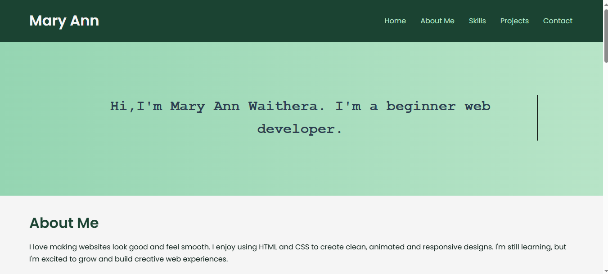
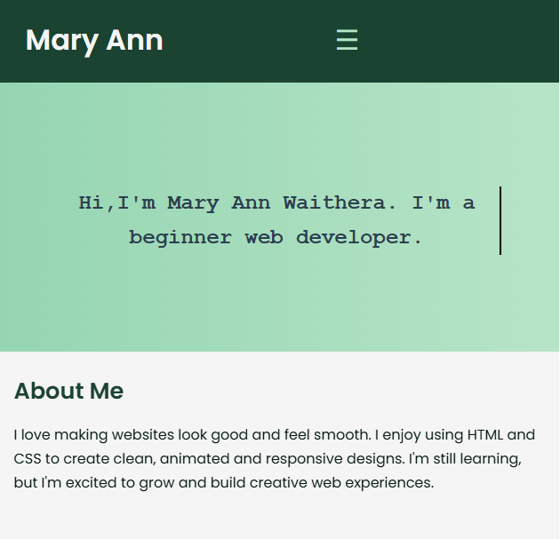

# 💼 My Portfolio – Mary Ann Waithera

Welcome to my personal developer portfolio built using **only HTML and CSS**. This portfolio showcases my skills, projects, and career details as I grow in the tech world.

## 👩🏽 Author

**Mary Ann Waithera**  
Aspiring developer with a passion for clean design, accessibility, and continuous learning.
- GitHub: [@maryann-0000](https://github.com/maryann-0000)  

## 🛠 Technologies Used

- HTML
- CSS
- FormSubmit (for contact form handling)
- GitHub Pages (for hosting)

## 📄 Project Structure

The portfolio includes the following files and folders:

my-portfolio/
│
├── index.html
├── about.html
├── style.css
│
├── images/ # All images used across pages
├── assets/ # PDF resume/CV and other files
├── README.md # Project documentation

## 📸 Screenshots

### Desktop View  

### Mobile View  

## ✨ Features

- Fully responsive layout (desktop, tablet, mobile)
- Smooth CSS animations (no JavaScript)
- Form integrated with [FormSubmit](https://formsubmit.co)
- Downloadable CV (PDF format)
- Section-based navigation with sticky header
- Hosted on GitHub Pages

---

## 🧠 Design Decisions

- **Color Palette**: Black and green theme to reflect elegance and creativity  
- **Typography**: Sans-serif fonts for professional, clean readability  
- **Layout**: Divided into clear sections—About, Skills, Projects, Contact—for smooth navigation

## 📬 Contact Form

This site uses [FormSubmit](https://formsubmit.co) for contact form submissions.  
Submitted messages are sent directly to my email: maryannwaithera699@gmail.com

## 🚀 Hosting

This site is hosted using GitHub Pages and is fully responsive for both desktop and mobile devices.

Live site: [https://maryann-0000.github.io/my-portfolio/](https://maryann-0000.github.io/my-portfolio/)

## 💬 Feedback

Your feedback is welcome!  
Feel free to use the contact form on the site or [open an issue](https://github.com/maryann-0000/my-portfolio/issues) on GitHub.

## 📄 License

This project is for personal and educational use.
